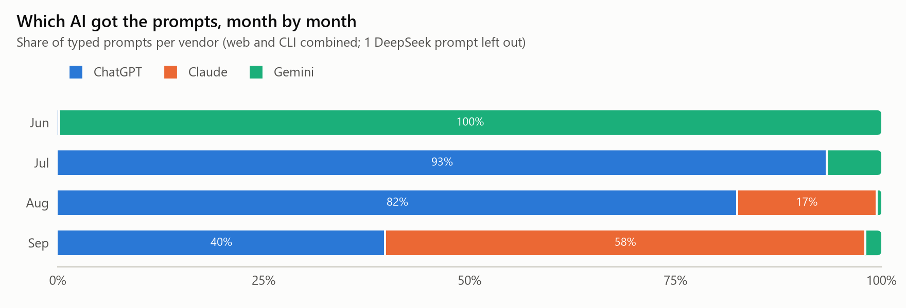
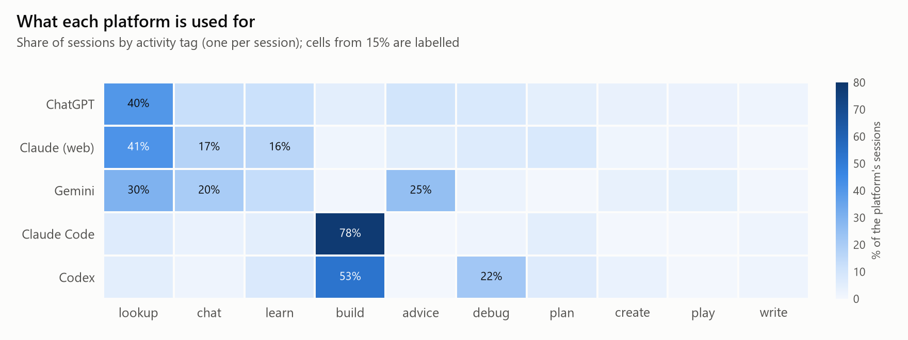
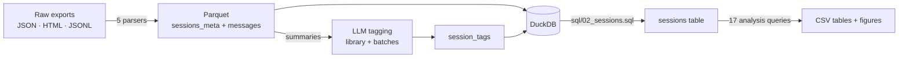

# Personal AI Usage Analysis

**1,054 conversations and 12,323 prompts across ChatGPT, Claude, Gemini, Claude Code and Codex — cleaned, unified, tagged by an LLM and analysed with SQL.**

Every platform exports its history differently: a JSON tree (ChatGPT), a JSON list with edit branches (Claude), an HTML activity log (Gemini), and append-only JSONL transcripts that copy themselves on resume (Claude Code, Codex). This project turns all five into one data model and answers questions like *which AI do I use for what, and how has that changed?*

Python · pandas · DuckDB SQL · Parquet · tiktoken · BeautifulSoup · matplotlib · pytest · Claude / OpenAI APIs

## What it does

- **Five parsers, one schema.** Each platform is flattened into the same two tables (one row per session, one row per content block), so the analysis SQL is written once.
- **Fixes the data-quality traps** that would otherwise distort every number:
  - 162 of 323 Codex transcripts were imported *copies* of Claude Code sessions.
  - Claude Code copies a session's whole history on every resume: 168 files are really **64** sessions.
  - One API response is split across records that repeat the same usage — summing naively overstates output tokens **5.5×**.
  - Over 95% of Claude Code "user" records are tool results, not typed prompts.
  - ChatGPT's "branch in new chat" duplicates messages with identical ids.
  - 98 of 173 Claude web conversations in the export are completely empty.
- **Comparable metrics across platforms**: turns counted from typed prompts only, tokens estimated with one tokenizer everywhere, context size taken from the last turn instead of summed.
- **LLM tagging with a controlled vocabulary**: a 94-tag library built from a stratified sample, then every session tagged against it (one activity tag + topic tags). Works through the Claude or OpenAI APIs, or any OpenAI-compatible provider (Gemini, Qwen, Kimi, Doubao, DeepSeek, GLM, MiniMax).
- **61 tests**: parser invariants, exact counts derived independently during exploration, the SQL `sessions` table recomputed in pandas and compared row by row, and offline tests of the API tagging code.

## Results

<picture>
  <source media="(prefers-color-scheme: dark)" srcset="reports/figures/vendor_share-dark.png">
  
</picture>

<picture>
  <source media="(prefers-color-scheme: dark)" srcset="reports/figures/activity_by_platform-dark.png">
  
</picture>

- **Vendors changed twice in four months**: Gemini in June, ChatGPT from July (93% of prompts), Claude reaching 58% by September. *Caveat: Claude Code keeps transcripts for ~30 days, so its early share is a lower bound.*
- **Each tool has a job**: the coding CLIs are for building (Claude Code 78% of sessions), ChatGPT is mostly quick lookups (40%), Gemini was the advisor and chat partner (25% + 20%).
- **Chat and coding differ in style**: a CLI session opens with a long brief (median 77 characters) and continues with short corrections; web prompts stay at 11–14 characters throughout.
- **One project dominates**: `minecraft-modding` (109 sessions) with `flight-physics`, `game-weapons` and `game-performance` co-occurring at ~8× chance level; those sessions average up to 50 prompts.
- **41% of sessions end within two prompts** — 55% for lookups, 15% for games.

All 9 figures are in [`reports/figures/`](reports/figures/) and the data behind them in [`reports/tables/`](reports/tables/) (one CSV per query).

## Quick start

```bash
python -m venv .venv && .venv/Scripts/activate      # Windows; use source .venv/bin/activate elsewhere
pip install -r requirements.txt
python run_pipeline.py    # parse -> merge tags -> build DuckDB -> figures (~40 s)
python -m pytest -q       # 61 tests
```

`run_pipeline.py` expects the raw exports under `Data/raw/{ChatGPT,Claude,Gemini,Claude Code,Codex}/`.

Query the result with any DuckDB client:

```python
import duckdb
con = duckdb.connect("Data/aiusage.duckdb", read_only=True)
con.sql("SELECT platform, COUNT(*) FROM sessions GROUP BY platform").df()
```

Tagging new sessions (costs money — start with `--dry-run`):

```bash
python -m aiusage.tagging prepare
python -m aiusage.tag_api tag --provider claude --dry-run
python -m aiusage.tagging merge
```

Other providers: `--provider openai|gemini|qwen|kimi|doubao|deepseek|glm|minimax --model <name>`, each reading its own API-key variable (`ANTHROPIC_API_KEY`, `OPENAI_API_KEY`, `GEMINI_API_KEY`, `DASHSCOPE_API_KEY`, `MOONSHOT_API_KEY`, `ARK_API_KEY`, `DEEPSEEK_API_KEY`, `ZAI_API_KEY`, `MINIMAX_API_KEY`). `--base-url` switches endpoints.

## How it works



| Table | Grain |
|---|---|
| `messages` | one content block (text, thinking, tool call, tool result) |
| `sessions_meta` | one session: platform, model, title, project, real API token counts (CLI) |
| `session_tags` | one tag of one session (`activity` / `topic` / `project`) |
| `sessions` | one session with turns, token split, duration, first prompt |

The analysis layer is plain DuckDB SQL: `FILTER` aggregates and `QUALIFY ROW_NUMBER()` build the session table; the 17 queries in `sql/analysis/` use window functions for shares and running totals, and a self-join for tag co-occurrence.

More detail: [`docs/data_quality.md`](docs/data_quality.md) (every issue and its fix), [`docs/sql_tasks.md`](docs/sql_tasks.md) (column definitions), [`docs/CODE_TOUR.md`](docs/CODE_TOUR.md) (reading order, in Chinese).

## Privacy

- `Data/` (raw exports, parsed files, database, tags) is git-ignored; only code, aggregate tables and figures are public.
- Topics about looks, health and relationships are removed from the public tables and figures (`PERSONAL_TAGS` in `aiusage/report.py`).
- Sessions listed in `Data/private_sessions.csv` are never sent to a model.
- Tagging sends only a summary per session (title, project, five shortened prompts), never full transcripts.

## Layout

```
aiusage/          parsers, tagging, database build, report
  llm/            one backend per API provider
sql/              load, sessions table, 17 analysis queries
tests/            parser, SQL and tagging tests
docs/             data quality, SQL definitions, code tour
reports/          public tables and figures
sql_practice*.ipynb   SQL exercises against the database
run_pipeline.py   end-to-end run
```

## Limitations

- One person's data over about three months; it describes a usage pattern, not AI users in general.
- Coverage differs per platform; Gemini's export has no titles, models or token counts, and Claude web has no model information.
- Topic tags are model judgements from short summaries; review files and the `first_user_message` column exist for spot checks.
- Time-of-day analysis assumes all activity happened in Hong Kong time.
