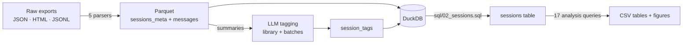

# Personal AI Usage Analysis

A data pipeline that turns the chat exports of **ChatGPT, Claude, Gemini, Claude Code and Codex** into one comparable dataset, tags every session with an LLM, and answers usage questions in SQL.

Every platform exports its history differently: a JSON tree (ChatGPT), a JSON list with edit branches (Claude), an HTML activity log (Gemini), and append-only JSONL transcripts that copy themselves on resume (Claude Code, Codex). None of them can be compared out of the box.

Python · pandas · DuckDB SQL · Parquet · tiktoken · BeautifulSoup · matplotlib · pytest · Claude / OpenAI APIs

## What it does

- **Five parsers, one schema.** Each export is flattened into the same two tables — one row per session, one row per content block — so the analysis SQL is written once and runs for every platform.
- **Handles the data-quality traps of real exports**, each of which would otherwise distort the results:
  - CLI transcripts copied between tools, so the same conversation appears under two products
  - resuming a conversation rewrites its whole history into a new file, turning one session into many
  - one API response split across several records that each repeat the same token usage
  - "branch in new chat" duplicating messages with identical ids
  - conversations exported with metadata but no content at all
  - tool results and injected system text stored under the `user` role, which is most of a CLI transcript
- **Metrics that survive the differences between platforms**: turns counted from typed prompts only (never raw records), tokens estimated with one tokenizer everywhere, context size taken from the last turn instead of summed across turns.
- **LLM tagging with a controlled vocabulary.** A tag library is built from a stratified sample, then every session is tagged against it (one activity tag plus topic tags), with validation and review files. Runs through the Claude or OpenAI APIs, or any OpenAI-compatible provider (Gemini, Qwen, Kimi, Doubao, DeepSeek, GLM, MiniMax) — each with its own preset for endpoint, structured-output mode and parameter names.
- **Analysis in SQL.** A session table built with `FILTER` aggregates and `QUALIFY ROW_NUMBER()`, plus 17 queries using window functions for shares and running totals and a self-join for tag co-occurrence.
- **Figures** in light and dark themes, rendered from the query results with a colour-blind-checked palette.
- **61 tests**: parser invariants, exact counts derived independently of the parser code, the SQL session table recomputed in pandas and compared row by row, and offline tests of the API tagging code with fake clients.

## Quick start

```bash
python -m venv .venv && .venv/Scripts/activate      # Windows; use source .venv/bin/activate elsewhere
pip install -r requirements.txt
```

Put the exports under `Data/raw/`:

```
Data/raw/ChatGPT/conversations-*.json      # ChatGPT export
Data/raw/Claude/conversations.json         # claude.ai export
Data/raw/Gemini/My Activity.html           # Google Takeout, Gemini Apps
Data/raw/Claude Code/<project>/*.jsonl     # copy of ~/.claude/projects
Data/raw/Codex/**/rollout-*.jsonl          # copy of ~/.codex/sessions
```

Then run the pipeline and the tests:

```bash
python run_pipeline.py    # parse -> merge tags -> build DuckDB -> figures
python -m pytest -q
```

Query the result with any DuckDB client:

```python
import duckdb
con = duckdb.connect("Data/aiusage.duckdb", read_only=True)
con.sql("SELECT platform, COUNT(*) FROM sessions GROUP BY platform").df()
```

### Tagging

Tagging calls a model API and costs money, so start with `--dry-run`:

```bash
python -m aiusage.tagging prepare                              # session summaries, no API calls
python -m aiusage.tag_api library --provider claude            # build the tag library
python -m aiusage.tag_api tag --provider claude --dry-run      # count requests only
python -m aiusage.tag_api tag --provider claude                # tag every batch
python -m aiusage.tagging merge                                # validate -> session_tags.parquet
```

Other providers: `--provider openai|gemini|qwen|kimi|doubao|deepseek|glm|minimax --model <name>`, each reading its own API-key variable (`ANTHROPIC_API_KEY`, `OPENAI_API_KEY`, `GEMINI_API_KEY`, `DASHSCOPE_API_KEY`, `MOONSHOT_API_KEY`, `ARK_API_KEY`, `DEEPSEEK_API_KEY`, `ZAI_API_KEY`, `MINIMAX_API_KEY`). `--base-url` switches endpoints. Runs are resumable and only missing sessions are requested again.

## How it works



| Table | Grain |
|---|---|
| `messages` | one content block (text, thinking, tool call, tool result) |
| `sessions_meta` | one session: platform, model, title, project, real API token counts (CLI) |
| `session_tags` | one tag of one session (`activity` / `topic` / `project`) |
| `sessions` | one session with turns, token split, duration, first prompt |

The queries answer things like: which vendor is used for which kind of work, how that changes over time, how deep sessions run per topic, which topics occur together, and how often a session is abandoned after one or two prompts.

More detail: [`docs/data_quality.md`](docs/data_quality.md) (every issue and its fix), [`docs/sql_tasks.md`](docs/sql_tasks.md) (column definitions), [`docs/CODE_TOUR.md`](docs/CODE_TOUR.md) (reading order, in Chinese).

## Privacy

This repository contains **code only**. Everything produced from a chat history stays local:

- `Data/` (raw exports, parsed files, database, tags) and `reports/` (figures and aggregate tables) are git-ignored.
- Topics about looks, health and relationships are filtered out of the public report outputs (`PERSONAL_TAGS` in `aiusage/report.py`).
- Sessions listed in `Data/private_sessions.csv` are never sent to a model.
- Tagging sends only a short summary per session (title, project, five shortened prompts), never full transcripts.

## Layout

```
aiusage/          parsers, tagging, database build, report
  llm/            one backend per API provider
sql/              load, sessions table, 17 analysis queries
tests/            parser, SQL and tagging tests
docs/             data quality, SQL definitions, code tour
run_pipeline.py   end-to-end run
```

## Limitations

- Built for one person's exports; the analyses describe a single usage pattern, not AI users in general.
- Coverage differs per platform: CLI tools delete old transcripts, and some web exports carry no titles, models or token counts.
- Web exports have no token counts, so those figures are estimates from one tokenizer.
- Topic tags are model judgements made from short summaries; review files exist for spot checks.
- Time-of-day analysis assumes a single fixed timezone.
